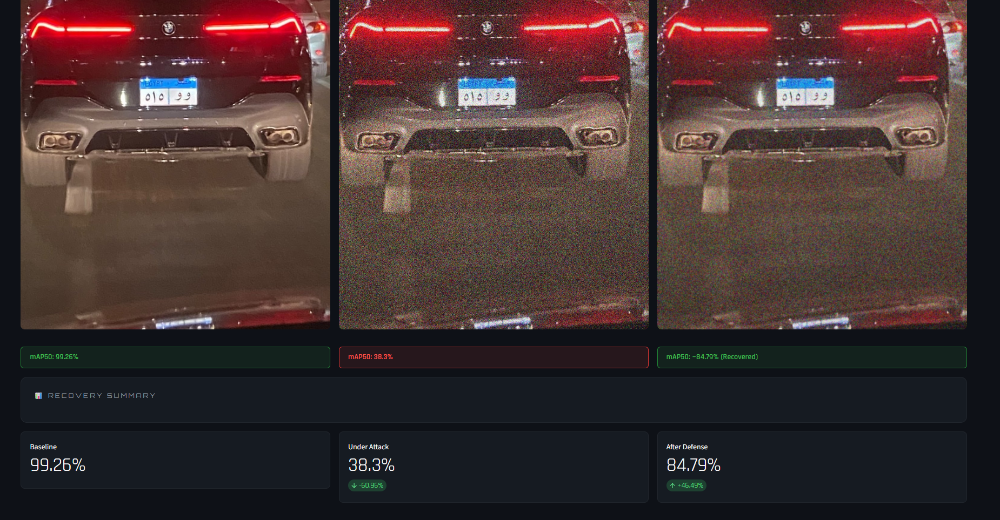
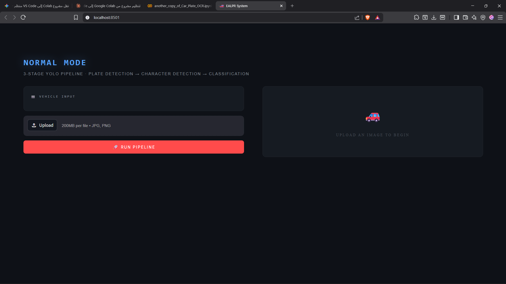
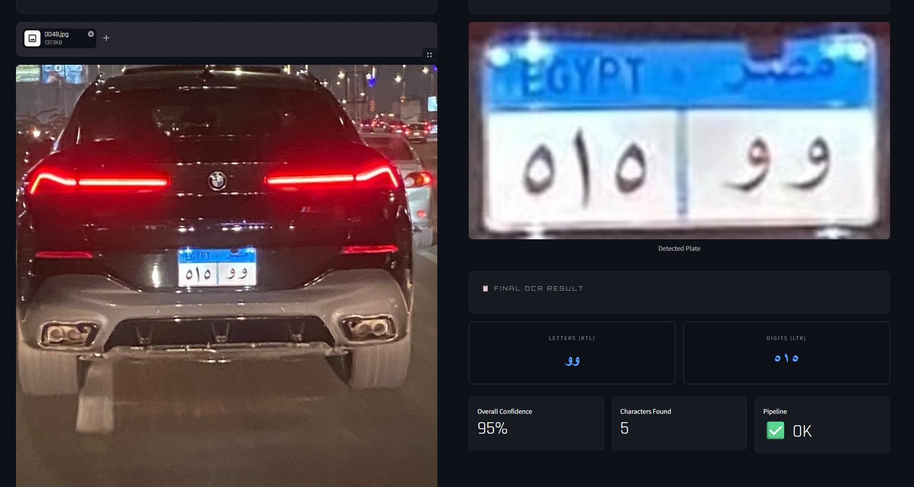
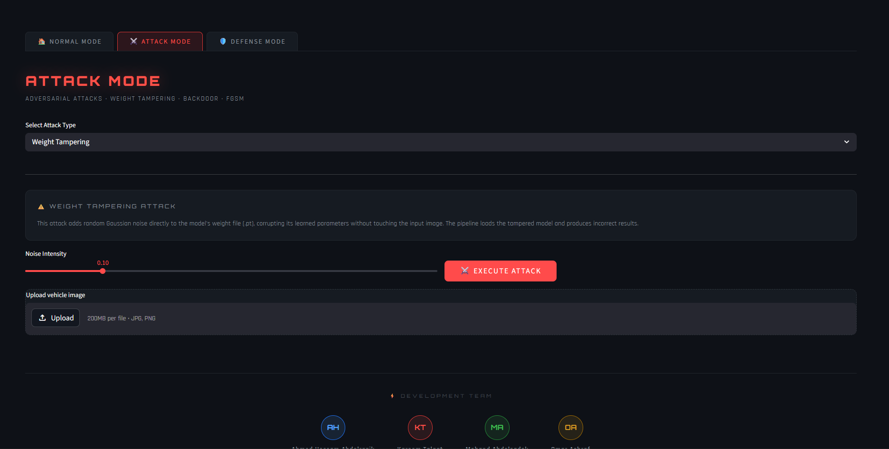
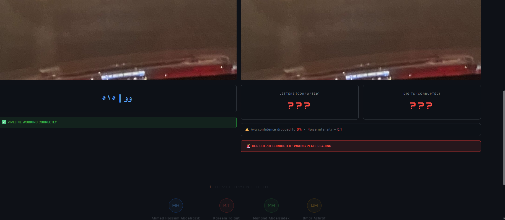
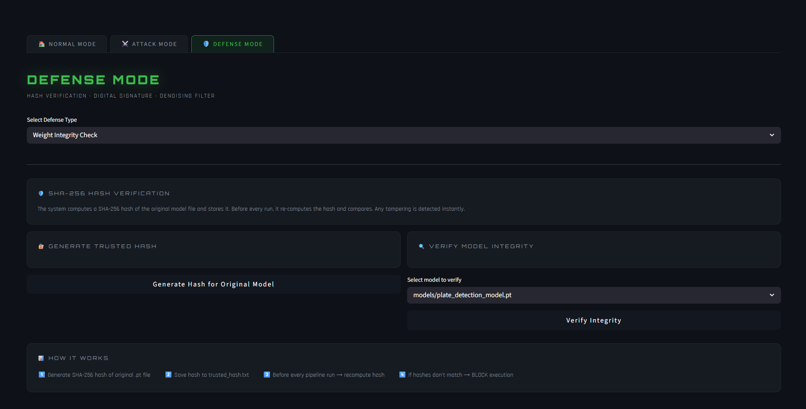

<div align="center">

# 🚗 EALPR — Egyptian Automatic License Plate Recognition

**A three-stage YOLOv8 pipeline for detecting and reading Egyptian license plates, hardened with an AI security layer against adversarial attacks.**

[](https://www.python.org/)
[](https://github.com/ultralytics/ultralytics)
[](https://streamlit.io/)
[]()

</div>

---

## 📖 Overview

EALPR is an end-to-end system that detects Egyptian vehicle license plates from images, localizes and classifies each character, and reconstructs the full plate text — while defending itself against common adversarial attacks on computer vision models.

The project was built as a graduation project for the **Data Science program, Faculty of Computers & Information Science, Sadat Academy for Management Sciences**, and combines two things that don't usually meet in a student project: a production-style detection pipeline, and a security layer that treats the model itself as an asset worth protecting.

## 🧩 Architecture

The recognition pipeline runs in three sequential YOLOv8 stages:

```
Input Image
    │
    ▼
[1] Plate Detector      → localizes the license plate in the full frame
    │
    ▼
[2] Character Detector  → detects individual character bounding boxes on the plate crop
    │
    ▼
[3] Character Classifier → classifies each character crop (Arabic letters + digits)
    │
    ▼
Reconstructed Plate Text (digits, right-to-left | letters, right-to-left)
```

See [`docs/System Architecture Diagram.png`](docs/System%20Architecture%20Diagram.png) and [`docs/Core Pipeline Data Flow sequenceDiagram.png`](docs/Core%20Pipeline%20Data%20Flow%20sequenceDiagram.png) for the full data flow.

## 🛡️ AI Security Layer

Beyond recognition accuracy, EALPR evaluates and defends against three adversarial threats targeting the model and its inputs:

| # | Attack | Description | Defense |
|---|--------|-------------|---------|
| 1 | **FGSM (Fast Gradient Sign Method)** | Adds imperceptible pixel-level noise to inputs to degrade detection accuracy | Gaussian + Median denoising filter applied before inference |
| 2 | **Backdoor Injection** | Embeds a visual trigger pattern into training/input images to force misclassification | RSA-PSS digital signature verification on incoming images |
| 3 | **Weight Tampering** | Directly perturbs the trained model's weights to sabotage performance | SHA-256 hash verification of model files before every inference run |

Each attack is benchmarked against the clean baseline to quantify its real-world impact, and each defense is evaluated for how much performance it recovers:

<div align="center">

</div>

| Stage | mAP50 |
|-------|-------|
| ✅ Baseline (clean model) | **99.26%** |
| 🔴 Under FGSM attack (ε = 0.1) | 38.3% |
| 🟢 After denoising defense | **84.79%** (+45.5 points recovered) |

## 📊 Results

| Metric | Value |
|--------|-------|
| Clean pipeline mAP50 | **99.26%** |
| Recovered mAP50 after defense | **84.79%** |
| Attacks covered | FGSM, Backdoor Injection, Weight Tampering |
| Defense mechanisms | Denoising, Digital Signatures, Hash Verification |

## 🖥️ Web Application

The system is deployed through a **Streamlit** web app with a dark, cybersecurity-inspired interface, offering three modes:
- **Normal Mode** — run the clean recognition pipeline on an uploaded image
- **Attack Mode** — simulate FGSM noise, backdoor triggers, or weight tampering live
- **Defense Mode** — apply and visualize the corresponding countermeasure in real time

### Screenshots

<table>
<tr>
<td width="50%">

**Normal Mode — Full Recognition Pipeline**

</td>
<td width="50%">

**Live OCR Result — 95% Confidence**

</td>
</tr>
<tr>
<td width="50%">

**Attack Mode — Simulating Weight Tampering**

</td>
<td width="50%">

**Attack Impact — OCR Output Corrupted**

</td>
</tr>
<tr>
<td width="50%" colspan="2">

**Defense Mode — SHA-256 Model Integrity Verification**

</td>
</tr>
</table>

## 🛠️ Tech Stack

- **Detection & Classification:** YOLOv8 (Ultralytics)
- **Computer Vision:** OpenCV
- **Security:** `cryptography` (RSA-PSS), `hashlib` (SHA-256)
- **Web App:** Streamlit
- **Language:** Python 3.10

## 📁 Project Structure

```
EALPR/
├── src/
│   ├── plate_detector.py       # Stage 1: plate localization
│   ├── char_detector.py        # Stage 2: character localization
│   ├── char_classifier.py      # Stage 3: character classification
│   ├── pipeline.py             # End-to-end orchestration
│   └── security/
│       ├── attacks/
│       │   ├── fgsm_attack.py
│       │   ├── backdoor.py
│       │   └── weight_tampering.py
│       └── defense/
│           ├── fgsm_defense.py
│           ├── image_signature.py
│           └── weight_checker.py
├── app.py                      # Streamlit web application
├── docs/                       # Architecture diagrams & result screenshots
├── requirements.txt
└── README.md
```

> **Note:** `dataset/` and `models/` (trained weights) are excluded from this repository due to size. See below for access.

## 🚀 Getting Started

### Prerequisites
```bash
git clone https://github.com/AhmedHAbdelrazik/EALPR-Egyptian-License-Plate-Recognition.git
cd EALPR-Egyptian-License-Plate-Recognition
pip install -r requirements.txt
```

### Dataset & Trained Models
Download links: `_coming soon_`

### Run the App
```bash
streamlit run app.py
```

## 👥 Team

| Name | Role |
|------|------|
| **Ahmed Hossam Abdelrazik** | Pipeline & Security Layer |
| Kareem Talaat | Team Member |
| Mohand Abdelsadik | Team Member |
| Omar Ashraf | Team Member |

**Supervised by:** Dr. Ahmed Assmet

Faculty of Computers & Information Science, Sadat Academy for Management Sciences — 2026

## 📬 Contact

**Ahmed Hossam Abdelrazik**
[LinkedIn](https://www.linkedin.com/in/ahmed-abdelrazik-5012693b7/) · [GitHub](https://github.com/AhmedHAbdelrazik) · ahmed.hossam.elwahy@gmail.com

---

<div align="center">
<sub>Built with YOLOv8, OpenCV, and Streamlit — secured against adversarial attacks.</sub>
</div>
